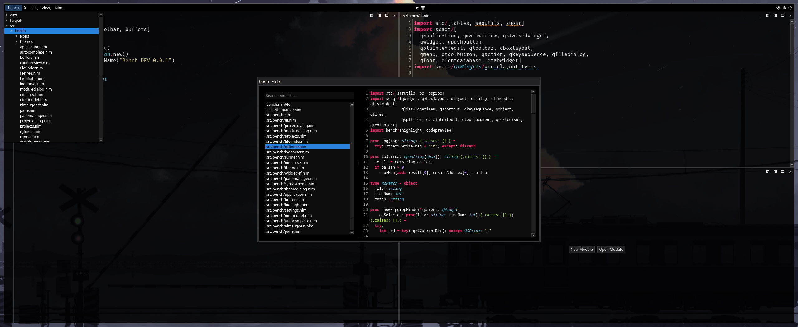

# Nide

[](https://github.com/dneumann42/nide/actions/workflows/release.yml)

A keyboard-driven IDE for Nim, built with Qt.



## Features

- **Project management** — File tree, recent files/projects, and file system watching for auto-reload
- **File finder** — Fuzzy file search (`Ctrl+X Ctrl+F`) and find-in-files with ripgrep (`Ctrl+Shift+F`)
- **Code intelligence** — Autocomplete, goto definition, find references, and function prototypes via nimsuggest
- **Import optimizer** — Detect and remove unused imports
- **Dependency viewer** — Graphviz-based module dependency graph
- **Build & run** — Build and run projects via nimble, with error navigation from output
- **Syntax highlighting** — Multiple themes: Nord, Solarized Dark/Light, GitHub Light, Monokai
- **Multi-pane editing** — Split horizontally or vertically, switch panes with `Ctrl+1-9`
- **Emacs-style editing** — Kill/yank, chord keys, and the rest of the usual suspects
- **Keybindings** — Fully configurable via settings UI
- **Diagnostics** — Inline error popover with nimsuggest diagnostics

## Requirements

- [Nim](https://nim-lang.org/) >= 2.2.6
- [Nimble](https://github.com/nim-lang/nimble) >= 0.22.2
- Qt 6.4+ (via [seaqt](https://github.com/seaqt/nim-seaqt))

### Fedora

```bash
sudo dnf install qt6-qtbase-devel qt6-qtbase-private-devel qt6-qtsvg-devel qt6-qtmultimedia-devel
```

### Arch Linux

```bash
sudo pacman -S qt6-base qt6-svg qt6-multimedia
```

## Installation

### Flatpak

```bash
flatpak install io.github.dneumann42.Nide
```

### From source

```bash
nimble build
```

Run with:
```bash
./nide
```

## Keyboard Shortcuts

### Navigation & Files

| Shortcut | Action |
|----------|--------|
| `Ctrl+X Ctrl+F` | Open file finder |
| `Ctrl+S` | Find in current buffer |
| `Ctrl+Shift+F` | Find in files (ripgrep) |
| `Ctrl+Shift+E` | Toggle file tree |
| `Ctrl+O` | Open file |
| `Ctrl+D` | Dashboard |
| `F3` | Goto definition |

### Editing

| Shortcut | Action |
|----------|--------|
| `Ctrl+Space` | Set mark |
| `Ctrl+;` | Autocomplete |
| `Ctrl+G` | Cancel selection/search |
| `Ctrl+F3` | Show function prototype |
| `Ctrl+K` | Kill line |
| `Ctrl+W` | Kill region |
| `Alt+W` | Copy selection |
| `Ctrl+Y` | Yank |
| `Ctrl+X Ctrl+S` | Save buffer |
| `Ctrl+X K` | Kill buffer |
| `Ctrl+X Space` | Rectangle mark |

### Panes

| Shortcut | Action |
|----------|--------|
| `Ctrl+\` | Add column |
| `Ctrl+Shift+\` | Split row |
| `Ctrl+X 2` | Split horizontal |
| `Ctrl+X 3` | Split vertical |
| `Ctrl+X 1` | Close other panes |

### Misc

| Shortcut | Action |
|----------|--------|
| `Ctrl+=` / `Ctrl+-` | Zoom in/out |
| `Ctrl+Q` | Quit |

Emacs-style cursor movement (`Ctrl+F/B/N/P/A/E`, `Alt+F/B`, etc.) works throughout. All bindings are configurable in Settings.

## License

MIT
